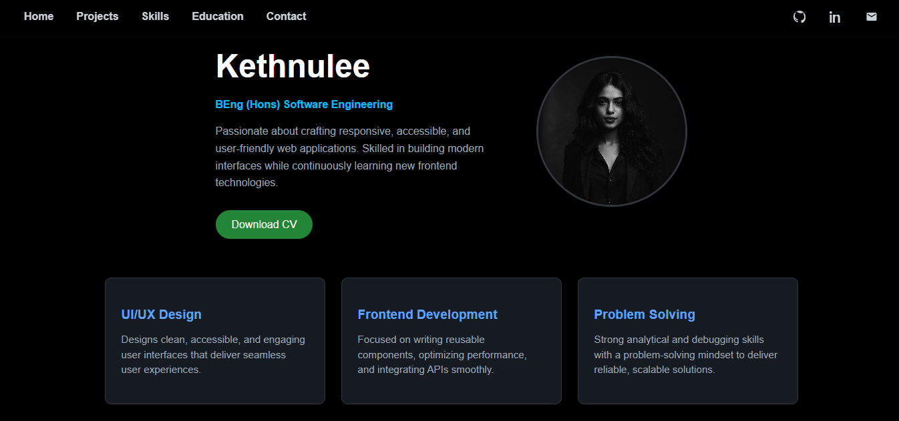

# Portfolio Website

A fully responsive and modern personal portfolio website to showcase my frontend development skills, selected projects, education, and technical expertise.

**Live Website:** [https://your-live-site-link.com]([https://your-live-site-link.com](https://kethnulee-weerasinghe.github.io/Portfolio-Website/))



## Overview

This portfolio site is designed to present a clear, concise view of my professional profile. It includes:

- Project highlights with GitHub links
- Downloadable resume
- Timeline-based education section
- Categorized technical skill set
- Responsive layout for desktop, tablet, and mobile
- Contact form

## Technologies

- HTML5
- CSS3
- JavaScript
- React.js
- Web3Forms (contact form handling)

## Running Locally

To view or edit the project locally:

```bash
git clone https://github.com/Kethnulee-Weerasinghe/Portfolio-Website.git
cd Portfolio-Website
